# 绘制关卡草图

## 为什么要设计关卡草图

**Layout** 在关卡设计中有两种类似的含义：

1. **关卡的整体结构**；「这个关卡构造（layout）太令人迷惑了，我不知道要去哪」
2. **用于规划的概览图**，有时候叫「俯视图」，因为它是从自顶向下的视角绘制的；「您完成了关卡草图（layout）的绘制了吗？我们需要尽快搭建关卡白盒」

关卡草图可以简单或复杂、符号化或具象；它也可能是抽象或具体的。它可以是餐巾纸涂鸦或详细的平面图，依照情况而定。

任何有效传达核心设计的图像都可称为「好的关卡草图」。

<figure><figcaption>
哪种关卡草图绘制风格对你来说最高效？你自己决定
</figcaption></figure>


但请记住：_计划不是万能药_。**关卡草图不能告诉你关卡是否成立**，只有[关卡白盒](../blockout/)和[测试](../blockout/playtesting/)可以开始回答这个问题。**关卡草图不是关卡**，玩家永远玩不到你的草图。


<figure><figcaption>
一位开发者正在参考 DMA Design 为《侠盗猎车手1》（1996年）设计的纸质世界地图草图，照片来自 Steve Hammond（<a href="https://twitter.com/snap2grid/status/1597157105726853121">图来自 X</a>）
</figcaption></figure>

## 关卡草图相关概念

在设计关卡草图时，请利用这些设计概念：

* [**玩家流动**](flow/)**是玩家在关卡里移动的感觉。**
  * 玩家的移动是快还是慢，平稳还是突然？
  * 期望的玩家流动取决于[体验目标](../pre_production/README.md##体验目标)。突然的玩家流动并不是坏的。
  * [关键路径](critical_path.md)是完成关卡的理想路径。
  * [连通性](flow/critical_path.md)是真实世界的建筑师对流动的看法。
  * [垂直布局](flow/verticality.md)是关于支持玩家的垂直方向移动。
* [**设计构想**](parti.md)**是关卡草图的核心结构/主要思想。**
  * 将整个关卡草图绑定在一起的总体概念是什么？
  * 清晰的设计构想可以帮助你专注于设计中最重要的部分。
* [**类型学**](typology/)**是关于常见的草图模式和功能。**
  * 简化你思考关卡草图的方式。
  * 共享的设计词汇可以帮助您学习其他关卡并进行沟通。

<figure><figcaption></figcaption></figure>

## 如何设计一个关卡草图

设计关卡草图没有唯一的最佳方案。每个人（和项目）都可以用不同的方式制作关卡草图。不过如果你觉得有点迷失方向的话，试着做下面每件事：

1. [**前期制作**](../pre_production/README.md)：定义设计目标
2. **设计构想缩略图**：脑暴核心形状
3. **气泡图**：可视化区域之间的大小/玩家流动
4. **平面图**：更详细地绘制特定的房间形状
5. **游戏玩法标记**：添加标签和设计说明

对于小型的单人项目，根据需要做适量的关卡草图规划即可。

对于大型团队项目，尝试在共享白板上一起完成所有这些步骤。

<figure><figcaption>
从抽象网格（左）到平面图（右）的迭代绘制，来自 Francis Ching 《Architectural Graphics》
</figcaption></figure>

### 1. 前期制作计划

设计没有目的·的事物很难。在[前期制作](../pre_production/README.md)阶段，我们试图在制作之前定义和计划我们想要做什么。

所以在画关卡草图之前，先定义至少一个玩家**体验目标**。在这个关卡，玩家需要学习、感受或者做什么？

你可以写出具体的体验目标（比如「在科幻风格下水道里用五分钟教会玩家如何二段跳」）或者更加抽象的（比如「感到和自然合而为一」）。但是更具体的体验目标 = 更好设计。

<figure><figcaption>
顽皮狗规划《最后生还者》（2012年）的节拍板，来自伦敦的维多利亚和阿尔伯特博物馆的“电子游戏”区域
</figcaption></figure>

一旦你有了一些目标，你就可以规划具体事件和活动的序列——[节奏](../pre_production/pacing.md)，帮助你实现体验目标。

例如，你的体验目标是「逃离可怕的怪物」，然后你可以将体验分解为更小的具体**节拍**，比如*「一、听到门后婴儿的哭声；二、揭露是僵尸熊发出婴儿的哭声；三、跳出窗户逃离怪物。」*（这个简单的计划已经帮了很大的忙，现在可以知道我们需要一扇门、一扇窗、一只熊......）

_要更详细地规划体验目标，见_[_前期制作_](../pre_production/README.md)_。_

_要进一步规划活动和节拍，见_[_节奏_](../pre_production/pacing.md)_。_

### 2. 设计构想缩略图

在建筑学中，[设计构想](parti.md)是整个建筑的基本形状/想法。

​	a. 绘制一个*简单的小示意图*（**缩略图**）  
​	b. 用一段简短的句子来标记它

什么类型的基本形状符合您的体验目标/节奏计划？

该设计构想可以是符号化的（「颠倒的船」）或是抽象的（「从方形削减」）或可以关注于人们将会怎样使用此建筑（「核心区域隔离公共和私人区域」）或与周围环境的关系（「建筑物延伸入树林」）。

或者你可以**凭感觉**画一些形状，稍后再整理出来。关键是要开始用视觉思考，不要有压力。如果你不喜欢某个设计构想，没关系，你可以随便再画一个。

<figure>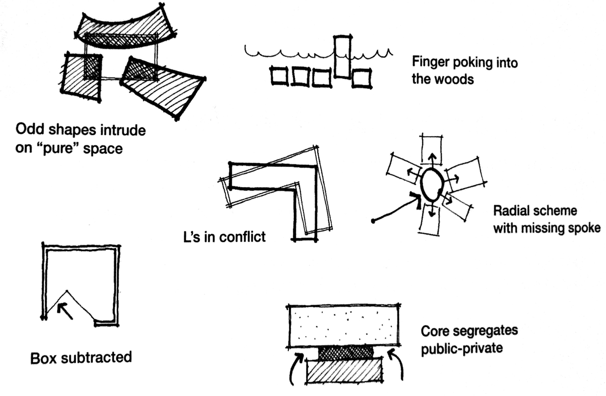<figcaption>
《101 Things I Learned in Architecture School》，Matthew Frederic 著
</figcaption></figure>

#### 关于设计构想缩略图的建议

* **绘制至少 5-10 个缩略图**，产生多样的想法。如果你画 100 个设计构想，那么至少有一个好的；因为不可能设计出 100 个糟糕的建筑。画得越多，机会愈大。
* **不要在每张图上花太多时间**。有时候只需 30 秒涂些线条就足以表达核心想法。
* **如果你没法给它取名，也许画得太粗糙了**。试着用其它方法再画一次，或者试着把纸旋转 180 度，从另一个角度想象它。

### 3. 气泡图

把你最看好的设计构想拓展成**气泡图**：一组不同的椭圆形，每个椭圆象征着不同的房间。

​	a. 把设计构想的每个部分画成一个**气泡**  
​	b. 标记每个气泡  
​	c. 画箭头，用来强调特定的连接或方向

气泡图的目的是建立关卡中的**比例**和**关系**。什么需要大一些？什么需要互相连通？

暂时不要担心细节。气泡图是关于你的空间的逻辑。

请看下面的气泡图示例。哪些空间需要和客厅相连，为什么？为什么卫生间在这里？卧室在哪里？如果有人无法使用楼梯，ta 将如何生活在这个房子里？

<figure>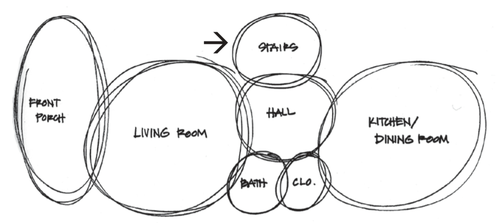<figcaption>
芝加哥 F10 住宅的气泡图示例，摘自 Masengarb 等人的《The Architecture Handbook: A Student Guide to Understanding Buildings》
</figcaption></figure>

#### 关于气泡图的建议

你的前几个气泡图会有问题并且会产生新的疑问。有的气泡会太大或太小，或者和错误的气泡相连。也许你漏掉了一些气泡？也许气泡太多了。

- **糟糕的气泡图也是有益处的。**那说明了你及早发现了设计问题，你可以再画另一个，尝试不同的布局。
- **画至少三个气泡图**，想象多个布局和尺寸。
- **你可以偏离设计构想。**设计构想的目的是帮助你开始画气泡。如果它不再对你有帮助，那就不要用它。

### 4. 平面图

在建筑学中，俯视角草图称为**平面图。**

​	a. 想象用一个假想的水平切面穿过建筑  
​	b. 在此切面*下方*绘制结构形状——墙段、门口、窗户以及重要的家具或设备  
​	c. 使用虚线或点线绘制切面*上方*的相关对象

在下面的图示中，注意 Ching 如何使用各种线型、线重、阴影和色调模式来区分平面图的各个部分。Ching 加粗加重了墙体，但是使用了更细的线来标记楼梯和房子的区域，使用更淡的线条表示旋转门的弧线。

<figure>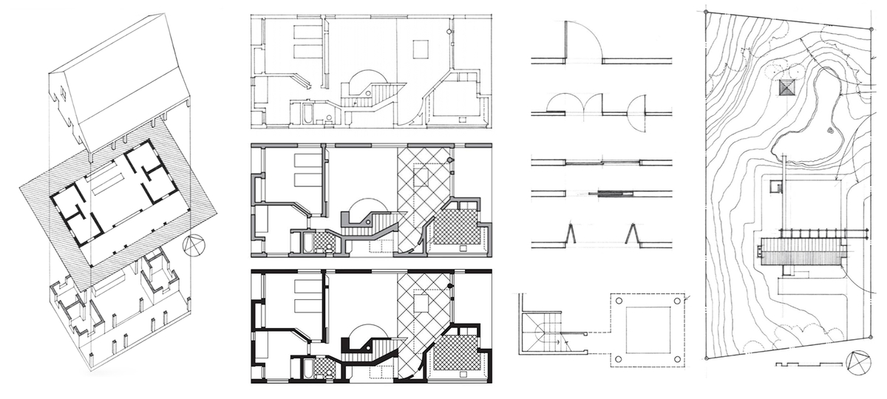<figcaption>
《Architectural Graphics》（第六版）中的各种平面图绘制技法，Francis D. K. Ching 著
</figcaption></figure>

#### 关于绘制平面图的建议

- **从大的开始。**使用整张纸。从大的主要形状开始，逐渐细化到小的特征，如门和窗户。不用绘制得太精细。
- **多用矩形。**矩形比奇怪的角度或者弯曲的墙更容易搭建。约 90% 以上的转角应为 90 度，并与网格对齐。
- **使用两种以上的线条粗细。**使用不同的线条粗细来表现不同类型的墙。
- **使用更有力的笔。**对于快速绘制关卡草图，用钢笔或者铅笔。
- **我们不是建筑师。**绘制出想象玩家体验所需的最少内容。


三种工作流技巧 - 绘制俯视的关卡设计多人地图关卡草图（以 CS:GO 为例）


### 5. 玩法标记

给关卡草图的重要部分**做标记**和打标签。

- **[玩家流动](flow/README.md)。**对于单人关卡，画或标记出[关键路径](critical_path.md)。对于多人地图，轻轻涂或标记出团队出生点和[连通性](flow/circulation.md)。
- **区域。**标记主要区域和地标。对于多人竞技地图，考虑可能的[「标注」](https://steamcommunity.com/sharedfiles/filedetails/?id=157442340)。
- **游戏物体。**标记重要的目标、NPC、物品、陷阱等和玩家体验息息相关的。但是不要用太多东西把画弄得杂乱。

<figure>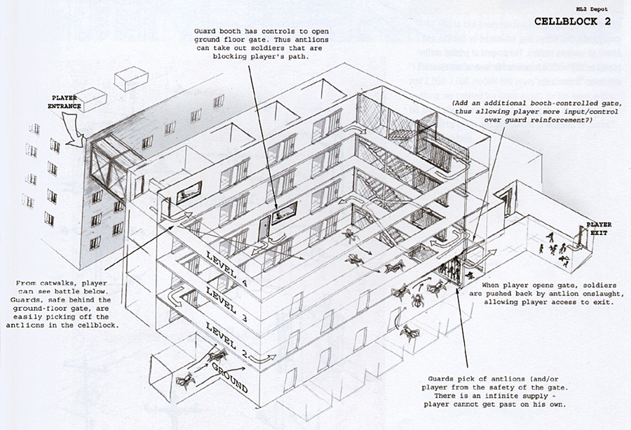<figcaption>
请注意，在这张由 Eric Kirchmer 绘制的《半衰期2》中的「诺瓦矿场」的等距关卡草图中，有大量的玩法标记，来自艺术设定集《Half-Life 2: Rasing The Bar》
</figcaption></figure>

<figure>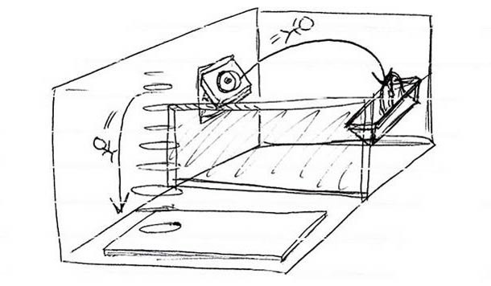<figcaption>
注意在这张《传送门2》中一个谜题的等距关卡草图中的玩家流动箭头，来自 Game Informer，2010年3月
</figcaption></figure>

<figure>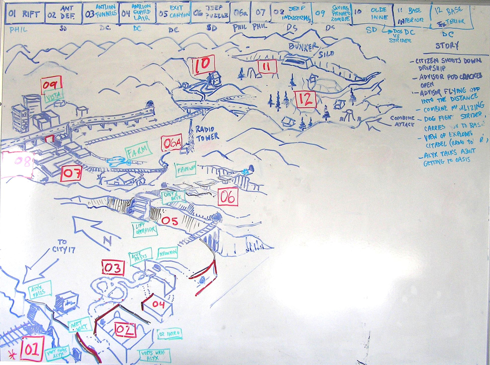<figcaption>
带有等距关卡草图和节奏大纲的真实 Valve 内部白板，用于规划《半衰期2》的第二章......然而，请注意，这张图和最终的游戏有所不同；由 Phil Co 拍摄（<a href="https://www.interlopers.net/articles/phil-co-interview">来自 Interloper.net</a>）
</figcaption></figure>

## 关卡草图例子

### 半衰期2（Valve）中的「诺瓦矿场」，作者 Eric Kirchmer 和 David Sawyer

大约在单人第一人称设计游戏《半衰期2》（2004）中游戏流程 2/3 的时候，玩家必须穿过一个被称为「诺瓦矿场」的废弃监狱。这是一个长章节，充满了多层近距离遭遇战，面对快速移动的敌军小队，设计上旨在充分利用玩家的「虫饵」武器，该武器可以指挥飞行的「蚁狮」怪物攻击敌方士兵。

- [研究](../pre_production/research.md)：大量借鉴了加利福尼亚州旧金山湾的恶魔岛联邦监狱
- [类型学](typology/README.md)：以地面战斗场为基础，旁边有狭窄的走道和监狱牢房，常常设有围栏/门
- [遭遇战](../combat/encounter.md)：分块、分房间设计，每个区域有一个中心概念，给蚁狮 vs. 联邦军的遭遇战增添新的变化

<figure>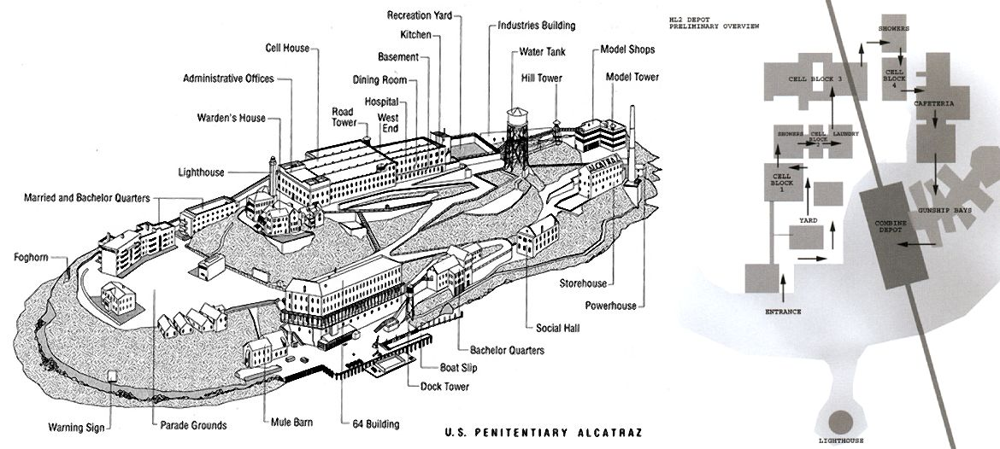<figcaption>
恶魔岛的地图（左）和诺瓦矿场的监房区域气泡图（右），来自艺术设定集 《Half-Life 2: Raising The Bar》
</figcaption></figure>

注意诺瓦矿场的规划（上方，右边）是一个相对简单的关卡草图，标记了区域和玩家会怎样通过它们。它忽略了每个建筑中的单个房间和走廊。这是针对一组关卡而非单一关卡的关卡草图。它和气泡图差不多，侧重于每个区域的占地面积及其连通性。

对于单独的监房区域和遭遇战，Valve 的概念艺术家 Eric Kirchmer 将直接关卡设计和玩法标记融入概念美术草图中，这些标记应该是和其他组成员一起在白板设计会议上协作完成的。这些遭遇战具有预期的玩家流动和理想的关键路径「解法」，每场战斗就好像是一个待解的谜题。这些草图给关卡设计师 David Sawyer 搭建关卡白盒和原型制作提供了有价值的设计文档。

注意在所有这些等距关卡草图中大量的玩法标记：玩家开始位置、关键路径箭头和大量用于辅助想象玩家体验的文本标签。

<figure>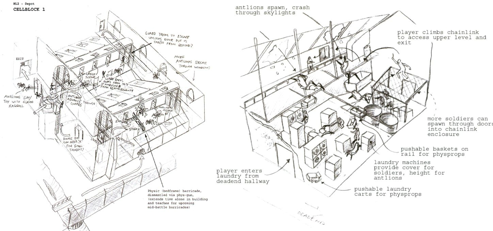<figcaption>
各种诺瓦矿场遭遇战的等距关卡草图，来自艺术设定集《Half-Life 2: Raising The Bar》
</figcaption></figure>

### 雷神之锤1的「未命名关卡」，作者 Andrew Yoder

在他的雷神之锤单人关卡中，设计师 Andrew Yoder 迭代了数次一个包含在房间中央的多个悬挂笼子的大场面遭遇战。在这里，Yoder 在关卡草图和关卡白盒之间反复流畅地切换，有时废弃一整个房间并画关卡草图重新设计。这里是[他的一些笔记](https://twitter.com/Mclogenog/status/1248992822725926912)：

<figure>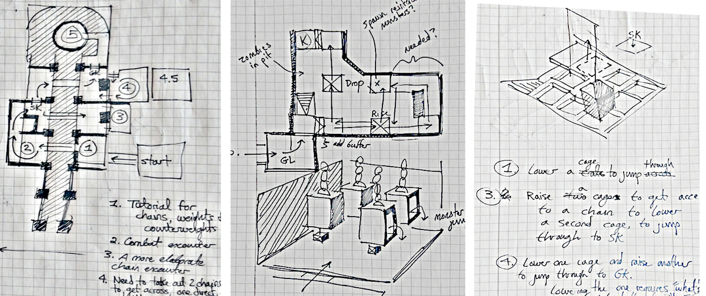<figcaption>
带有透视图的关卡草图（纸面墨水作图），由  Andrew Yoder 提供
</figcaption></figure>

> 我的设计流程是不断地迭代，这意味着时常返回到规划阶段。【...】有时我花了一个小时迭代一个区域然后突然就成了。其他时候，我花同样的一个小时，结果可能最好是把它暂时搁置，尝试其他东西。【...】那我是怎么判断（关卡好坏）的呢？从我过去搭建类似的关卡的经验中产生了直觉，还有一些模式可以检查：玩家知道目标吗？他们能否预见解决方案并为之规划？

注意图中用编号、大量使用的注释来标记草图的不同部分，并偶尔使用透视缩略图来阐明整体结构。当关卡草图涉及到高度变化时会很难从俯视视角绘制，这时透视缩略图特别有用。

各种各样的草图和丰富的标记帮助 Yoder 传达他的设计意图。绘制关卡草图的过程帮助 Yoder 表达设计问题。

<figure>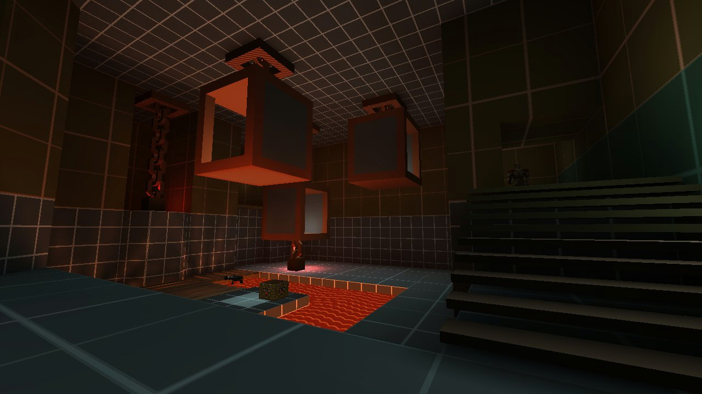<figcaption>
由此产生的《雷神之锤1》中悬挂笼子区域的关卡白盒截图，由 Andrew Yoder 提供
</figcaption></figure>

### 《看门狗2》（育碧）的「自动操控 - 电视台」，作者 luliu-Cosmin Oniscu

在开放世界黑客游戏《看门狗2》中，设计师 Iuliu-Cosmin Oniscu 创建了一个有着多目标、多入口和多个关键路径的任务。

在他的帖子[「看门狗2 - 自动操控 - 关卡设计回顾」](https://medium.com/@iuliu.cosmin.oniscu/watch-dogs-2-automata-a-level-design-retrospective-dcb82040e454)里，附上了带有大量玩法标记和最简建筑结构的关卡草图：

<figure>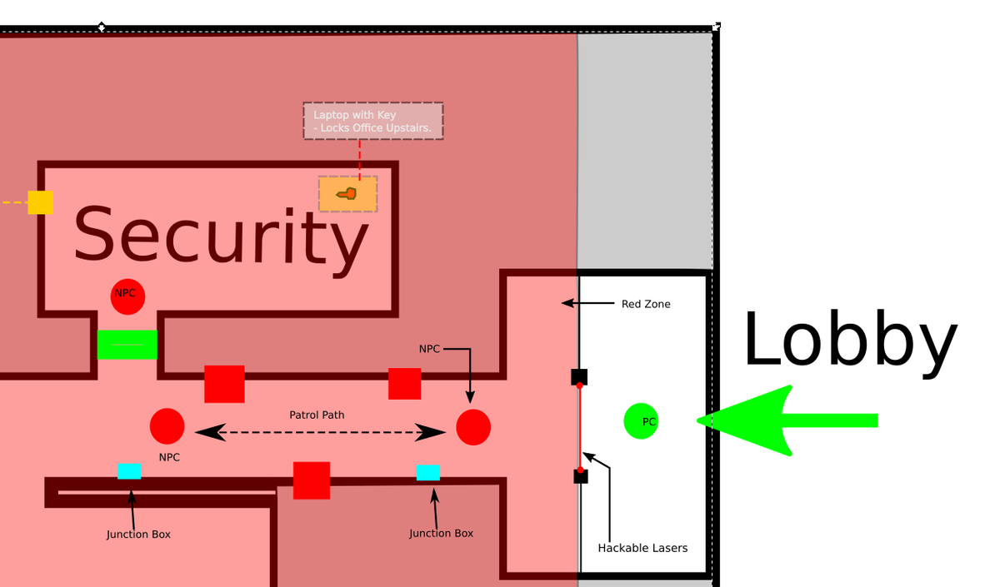<figcaption>
《看门狗2》的任务「自动操控」中 WKZ 站的关卡草图，由设计师 Iuliu-Cosmin Oniscu 绘制
</figcaption></figure>

一些设计师的笔记和设计意图：

> 在这个特殊的场景中，玩家可以穿过激光并触发警报，但玩家也可以：
>
> - 当守卫巡逻走开的时候，关闭激光，然后进入红色区域悄无声息地放倒 AI
> - 使用附着在墙上的摄像机，通过从一个摄像机角度移动到另一个角度来侦察位置。在游戏的这个阶段，这是一种已经成熟的侦察内部位置的方式
> - 使用无人机来探索走廊和瘫痪警卫
>
> 走廊那边也有一个特意放置的接线盒，可以骇入它们来同时瘫痪两个警卫

注意关卡设计师的绘图（上方的图片）远比实际游戏中的实现（下方的图片）要简单得多。建筑物细节、家具，甚至是一些玩法元素比如中立 NPC 和壁挂式摄像机都没有在关卡草图中呈现。这些东西和规划核心体验目标——通过击倒警卫 NPC 来绕过安防 不相关。

从这我们可以学到：**不要用非必要的元素来弄乱你的关卡草图。**

<figure>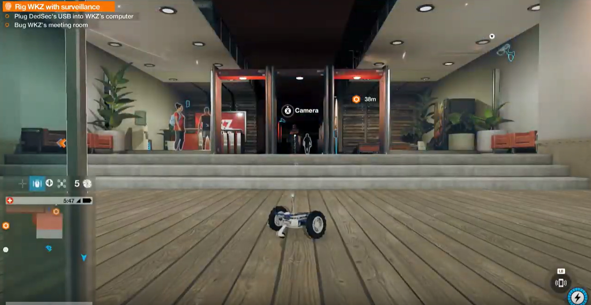<figcaption>
玩家视角中完成版的 WKZ 大厅，《看门狗2》中的任务「自动操控」，由 Iuliu-Cosmin Oniscu 设计
</figcaption></figure>

### 《军团要塞：经典》（Valve）中的「战争路线」，作者 Robin Walker 等人

在多人射击游戏《军团要塞：经典》（1999）中，「战争路线」是一张由 Robin Walker 和他在 Valve 的团队合作设计的一个占点地图。《军团要塞：经典》中的占点游戏模式和在《军团要塞2》或《守望先锋》中的现代占点模式类似，两支队伍争夺主道路上的所有控制点。

- [玩家流动](flow/README.md)：一条带有支路的主道路，总共5个控制点和动态生成的房间
- [平衡性](../combat/map_balance.md)：对称地图，所有 9 个职业必须都有用武之地，每个控制点都能进进攻和防御
- [类型学](typology/README.md)：串珠项链，一条长长的盘绕走廊上分布着每个控制点的战斗场地

<figure>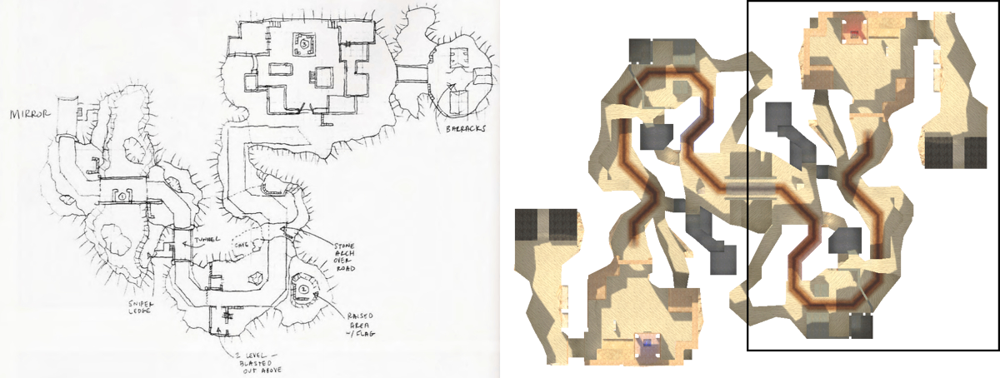<figcaption>
对比最初的计划和最后的关卡布局；《军团要塞：经典》中「战争路线」的图片
</figcaption></figure>

在《半衰期2》的艺术设定集《Raising The Bar》里，Walker 详细地描述了他们的设计流程和关卡草图如何融入他们的协作多人关卡设计工作流。

> 「在初始的设计讨论之后，设计团队开始绘制地图，之后交给关卡设计师来搭建。这个初始的版本完成之后，常规的游戏测试开始了。在整个游戏测试周期中会进行很多更改，**通常会导致对地图最初的计划产生剧烈的变化。**【...】「战争路线」是第一个队伍出生点根据队伍控制区域在不同位置的军团要塞地图，导致了多次移动出生点和长测试周期。」
>
> —— Robin Walker，来自《Half-Life 2: Raising The Bar》，第 48 页

在上方的绘图中，注意那些标序号的控制点和标签标注。每个控制点就像一个迷你战斗场地/设计构想，有特定的地标：狙击手壁架、隧道、石拱、兵营等。**从一开始就命名和给各区域定主题。**标签还强调了地图体验目标的最重要部分。

另请注意，这幅图只显示了地图的一半，地图在中央的桥处镜像对称。因为他们已经决定了地图布局会是对称的，所以没有必要画出整个地图。**因此，设计约束会影响你绘制关卡草图的方式。**

<figure>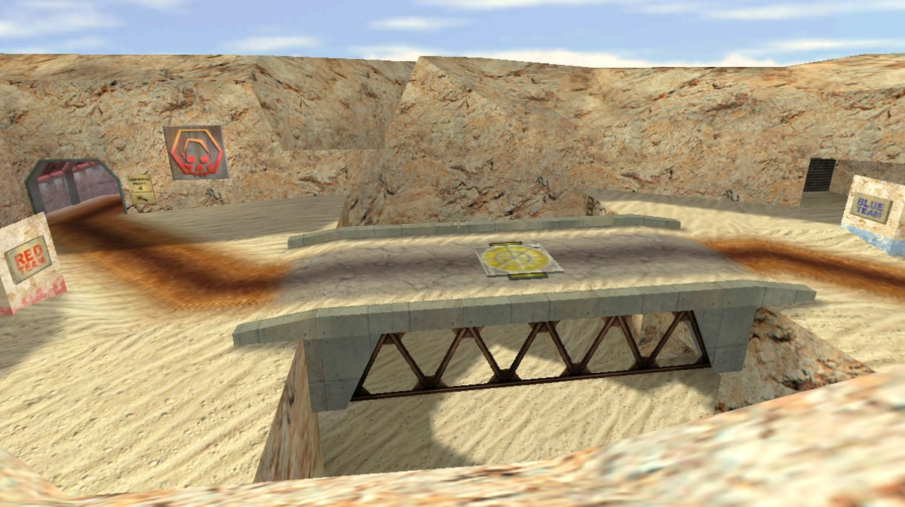<figcaption>
中央桥梁战斗场地，从蓝队的狙击手壁架向南看；来自《军团要塞：经典》「战争路线」
</figcaption></figure>

## 反对关卡草图？

虽然关卡草图似乎对关卡设计至关重要，但许多关卡设计师其实不画关卡草图，直接从前期制作阶段跳到关卡白盒阶段。一些反对制作关卡草图的论点：

- 你不能对关卡草图进行游戏测试。
- 绘图是很容易落后于更新的可视化文档。
- 真实世界中的建筑有草图是因为他们必须这么做；我们不应该无脑地模仿它们。
- 3D 游戏中的运动更多依赖直觉而不是精密计算。

对于知名的 3D 平台跳跃游戏《超级马里奥64》（1996），宫本茂的团队只使用了最基本的概念美术/草图来规划主要的游戏节奏节拍：

> #### *... 当你们制作关卡地图时，会事先画出模型/蓝图吗？*
>
> **宫本茂：**其实，没有，完全没有。只有一些概念艺术草图和简短的笔记/备忘录。例如，我会和项目总监山田洋一讨论一个关卡的想法，然后他会快速画一些草图。山田不是艺术家，但他有时画点怪东西。（笑）然后我们会对着这些草图进行详细讨论（「哦，这里应该有一个雪人！」），那些关卡的关键元素会被写下来。然后山田和其他关卡设计师会在使用我们的软件开发工具设计关卡时参考这些笔记。
>
> —— 《超级玛利欧64》攻略指南上的采访（来自 [shmuplations.com](https://shmuplations.com/mario64/)）

<figure>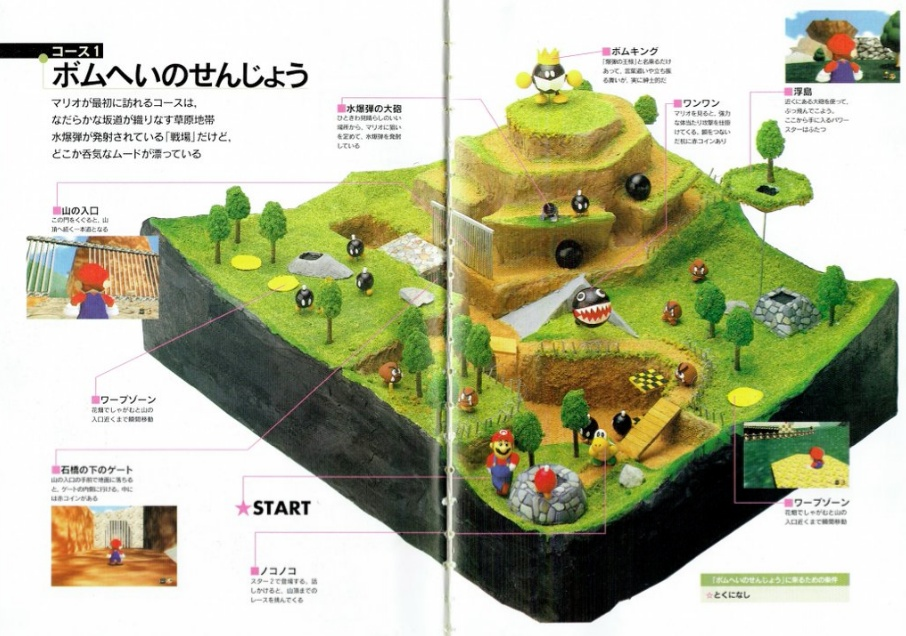<figcaption>
上面印有《超级马里奥64》「<a href="https://www.mariowiki.com/Bob-omb_Battlefield">炸弹王国</a>」关卡的立体黏土模型的杂志扫描件；这看上去像是预先规划好的关卡吗？因为这就不是！...来自《超级马里奥64完整清晰指南》（来自 <a href="https://shmuplations.com/mario64/"> shmuplations.com</a>）
</figcaption></figure>


#### 反-反关卡草图？

你也可以争辩宫本茂的方法不那么适用于其他不同的游戏类型、情况、团队。他们有一堆行业老手的专业开发者，并且互相认识和信任彼此，当然他们可以在没有计划的情况下即兴创作小型低多边形单人游戏关卡。


## 总结

**关卡草图**是关卡结构和关键节奏节拍的初始可视化规划。你的最终关卡应当会很不一样。

1. 从一个基本的[前期制作计划](../pre_production/README.md)开始，定义想要的[体验目标](../pre_production/README.md##体验目标)和[节奏](../pre_production/pacing.md)。
2. 画出[设计构想](parti.md)草图并做标记，核心形状的简单缩略图草图。
3. 用**气泡图**来安排空间，强调整体的比例和关系。
4. 画**平面图**，一个有着墙壁和地板的俯视图。
   1. 从大而简单的形状开始，省略细节。使用多个线宽并为地板区域着色。
   2. 对于具有多个楼层的房间，请绘制等距视角图，并注意楼板平面。
   3. 对于重要或复杂的大场面房间，可以绘制透视图并标记它。
5. 在计划上**标记**玩家流动和玩法说明。帮助他人想象游戏体验，尤其是当你和其他人协作的时候。
   1. 命名和标记区域。把关卡的每一块都看作单独的设计构想。

也说了，**许多关卡设计师不做布局图。**先试试看，如果它有助于你的思考或者团队沟通，就继续做下去。但是不必觉得这是强制的。

## 下一步怎么办？

- 阅读更多重要的[关卡草图设计概念](#关卡草图相关概念)。
- 你也可以继续阅读关卡设计的[关卡白盒](../blockout/)阶段。

### 关于关卡草图的拓展阅读（英语）

- ["Warowl and FMPone - Mapping for Fun"](https://www.youtube.com/watch?v=5hq4QSttI2k) ，作者 3kliksphilip
