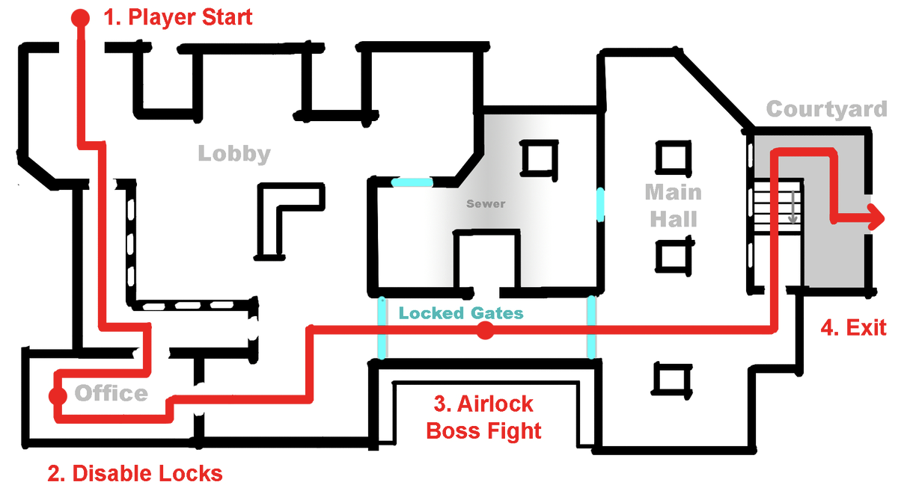
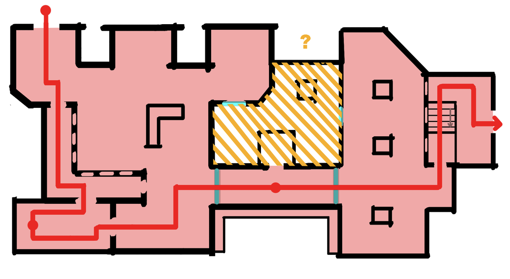
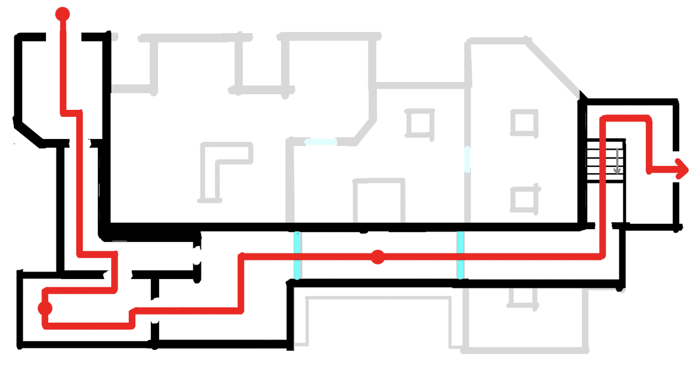
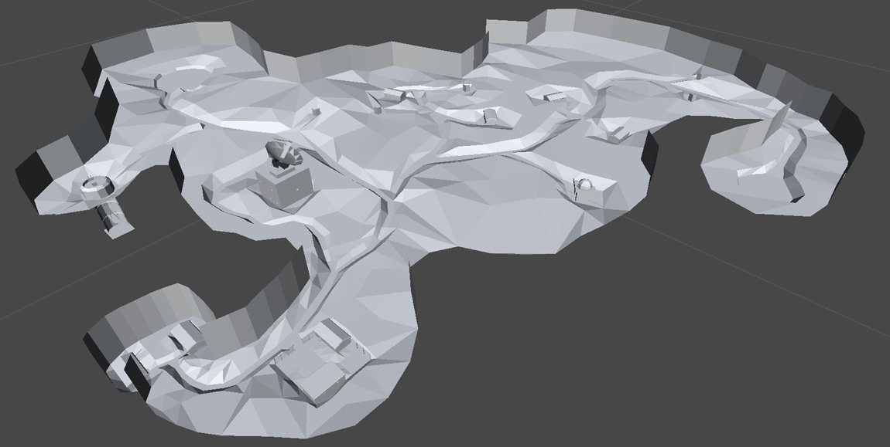
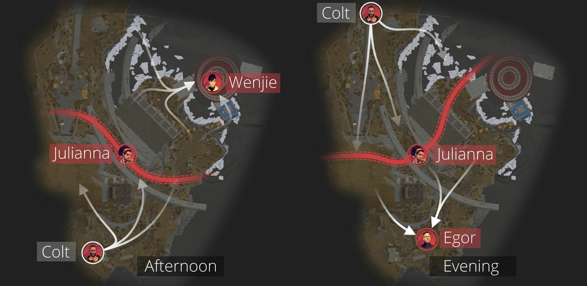

# 关键路径

**关键路径**（或者**黄金路径**）是玩家完成关卡和推进进度的主要预期路径/流程。

- 常指有固定流程的单人关卡，而非多人关卡
- 突出显示关卡中最重要（「关键」）的部分
- 展示了忽略可选支线区域的*理想玩家流动*

最后一点很重要。关键路径代表了你理想的设计目标和要求，但它并不是实际情况。大多数玩家会徘徊、探索、逗留，甚至只是迷惑下一步要去哪。

## 如何规划关键路径

在一张关卡草图中，关键路径标记帮助其他设计师和合作者理解关卡的[节奏](../pre_production/pacing.md)。什么事情发生了，在哪发生的？

1. 画一张初始的[关卡草图](README.md)。
2. 标记出玩家的开始结束位置。
3. 编号和标记出任何主要的[节拍](../pre_production/pacing.md)。
4. 如果这么做看起来不会太混乱，可以用箭头画出玩家的路线。

​     *有关绘制平面图的更多信息，请参阅[关卡草图](README.md)。*

<figure><figcaption>
示例关卡草图，标注了关键路径和带编号的玩法节拍
</figcaption></figure>

## 关键路径作为限定范围的工具

在工程中，项目经理使用关键路径法（[CPM](https://en.wikipedia.org/wiki/Critical_path_method)）来确定哪些任务必须首先发生以及为什么。绘制关键路径帮助他们理解项目的逻辑和玩家流动。

类似地，我们在关卡设计中也可以使用关键路径来帮助限定项目[范围](../pre_production/scope.md)。

- 关卡的每一部分重要性如何？
- 如果某些东西不在关键路径上，那么只有一部分玩家会看到。那是否值得制作？

<figure><figcaption>
黄色阴影区域可以在不影响关键路径的情况下移除
</figcaption></figure>

关键路径帮助我们想象一个「最小可行」的关卡草图是怎样的。

举个例子，在上方的关卡草图中，黄色阴影区域不在关键路径上。那这部分还值得制作吗？如果我们去掉这部分，可以减少工作量。

或许关卡还是太大、工作量会很大。或许我们应该删掉更多。

如果我们删除所有的支线区域呢？那关卡是否仍然满足我们的体验和设计目标？那样的话，我们可能需要重新设计整个关键路径……

<figure><figcaption>
如果我们删掉所有「不必要」的区域会怎样？现在搭建关卡的工作量减少了，但它还能满足我们的体验目标吗？
</figcaption></figure>

## 反对关键路径？

围绕关键路径设计可能是一种对空间过度简化的设计方式。

关键路径将世界工具化为各种资源、门和目标点，一张由关卡设计师强加在玩家身上的活动清单。游戏和关卡能否不仅仅是供玩家消费的「内容」？如果你的项目需要高度的真实性、合理性或场所感呢？围绕关键路径构建关卡通常会导致空间过于「电子游戏风味」。

相反，一些设计师更喜欢在已经完成[关卡草图](../layout/README.md)和[关卡白盒](../blockout/README.md)之后构建关键路径，利用现有的关卡几何。任天堂 64 游戏《黄金眼007》（1997）的制作人 Martin Hollis 解释了他们的关卡设计过程：

> 「关卡创作者或建筑师在设计时并没有太多考虑关卡设计，我的意思是，他们通常没有考虑玩家的起点或出口。当然，他们也没有考虑敌人的位置或物品的位置。他们的工作只是创造一个有趣的空间。在关卡制作完成后，Dave 或有时是 Duncan 会负责在其中填充目标、敌人和其他内容。这种随意且无计划的方法的好处是，游戏中的许多关卡都带有一种真实且非线性的感觉。有些房间与关卡没有直接关联。关卡中有多条路径。坦率地说，这是一种反游戏设计的方法。它是低效的，因为关卡中的许多部分对游戏玩法来说是不必要的。但它为玩家提供了更大的自由感和真实感。而这种自由感和真实感反过来又极大地促进了游戏的成功。」
>
> —— Martin Hollis，《黄金眼007》（N64）制作人，引自 Chris DeLeon 的文章《反设计/逆向游戏设计在 黄金眼007 中的应用》

<figure><figcaption>
《黄金眼007》（1997）中「表面」关卡的几何结构，由 Chris DeLeon 截图。https://imgur.com/a/MY59R
</figcaption></figure>

## 关键路径案例：《死亡循环》（2021）

在下图中，展示了第一人称 RPG 游戏《死亡循环》（2021）中「复杂区」关卡的设计图，关卡设计师 Sylvain Menguy 标出了这张非线性单人地图的关键路径。他们记录了下午和晚上的两种配置，以及玩家前往区域 Boss 的可能路径。

> 这个游戏有 4 张主要的地图，并且可以在一天中的四个时间段玩（早上、中午、下午和晚上），玩家可以自由探索关卡、进行战斗、发现谜题，或者甚至解开构成游戏主要冒险内容的「谋杀之谜」……

这张简化的关卡流程图省略了不必要的细节，以突出整体结构，这对于传达[节奏设计](../pre_production/pacing.md)非常有用。请注意下图的白色箭头并不完全和地图地形匹配，但仍然传达了大量关于预期路线的信息。尽管玩家一开始有 3 条路径可选，但这些路径最终都会汇聚到地图另一端的 Boss 区域的两个入口。

<figure><figcaption>
《死亡循环》（2021）地图「复杂区」的关卡流程图，<a href="https://sylvainmenguy.com/en/project/deathloop">由 Sylvain Menguy 设计，来自 SylvainMenguy.com</a>
</figcaption></figure>

> 「这张地图从一开始就设计为支持多人玩法，允许另一名玩家在下午或晚上入侵。因此，在这两个时间段中，玩家对关卡布局的理解会有所不同，而与反派角色朱丽安娜的遭遇战也会不同——她会来追捕柯尔特并给他制造麻烦。
>
> 这个在不同时间段共享的关卡布局始终提供了多种寻路导航选择，避免出现死胡同和无法脱身的长走廊，以确保更流畅的游戏体验，并让玩家能够快速在不同区域之间转移……」
>
> —— [Sylvain Menguy](https://sylvainmenguy.com/en/project/deathloop)

「转移」是指当玩家必须将注意力转移（「轮转」）到另一个地图区域，通常出现在小队多人射击游戏中，比如《反恐精英：全球攻势》。有趣的是，Menguy 将多人游戏的关卡设计思维应用到了单人游戏关卡中。

​     *有关在多人游戏设计中的转移的更多信息，请参阅[地图平衡](../combat/map_balance.md)。*

## 总结

**关键路径**是玩家在单人游戏关卡中推进的理想路线。

它主要是一种规划和限定范围的工具。它有助于在[关卡草图](../layout/README.md)中传达[节奏设计](../pre_production/pacing.md)。如果你需要缩小项目范围，它可以帮助你决定关卡中的哪些部分可以删减。

然而，优先考虑关键路径可能会导致空间具有比较强的人造感。一些关卡设计师会先设计一个空间，然后再确定关键路径。

## 下一步怎么办？

- 阅读更多关于[关卡草图](../layout/README.md)和[玩家流动](flow/README.md)的内容。
- [空间流线](flow/circulation.md)也是一个值得思考的概念。
