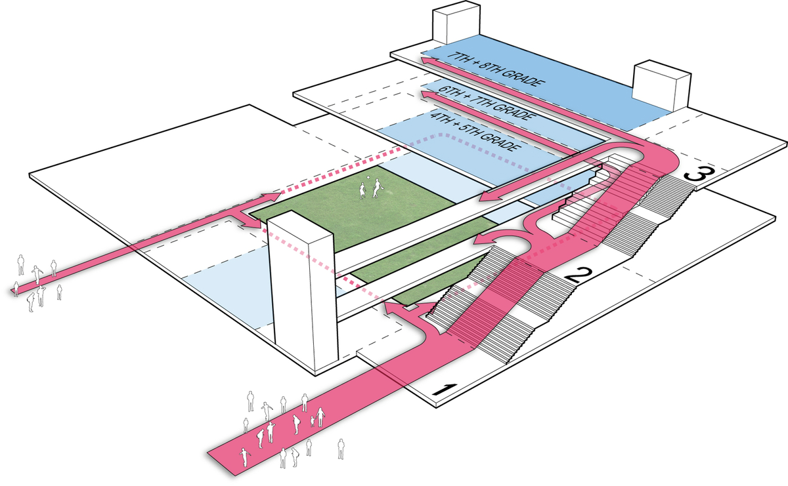
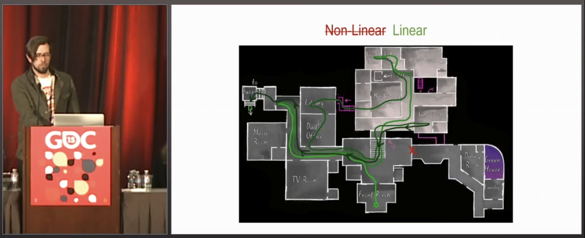
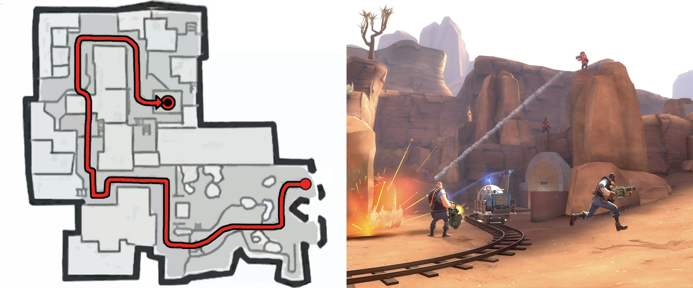
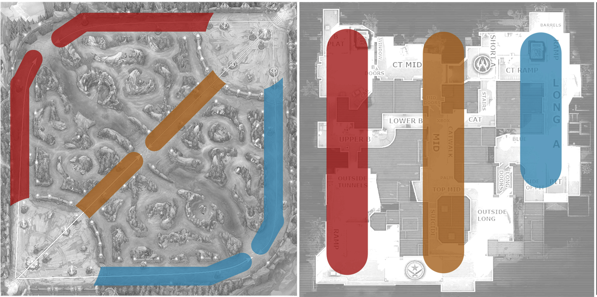

# 空间流线

在建筑学中，**空间流线**通常指那些连接了其他区域的「中间」区域，比如走廊、过道和楼梯。

一些关卡设计师称之&#x4E3A;_&#x8FDE;通性_。但在这本书中，我们觉&#x5F97;_&#x7A7A;间流&#x7EBF;_&#x8FD9;个词/概念更适合，这个说法应该被更多关卡设计师采用。

## 空间流线的类型

现实世界的建筑师会把空间流线的类型分成这几类：

* **主要** vs. **次要** 空间流线 _（去主电梯的路径 vs. 去储物柜的路径）_
* **公共** vs. **私人** 空间流线 _（一楼大堂 vs. 卧室走廊）_
* **水平** vs. **垂直** 空间流线 _（走廊 vs. 楼梯）_

这其中的许多考虑通常不直接适用于关卡设计。与不幸的现实世界建筑师不同，我们可以设计虚拟建筑，无需对建筑规范、条例和热力学有任何顾虑。不过，这些词和概念仍然有用。

<figure><figcaption>
成就预备学院中学的空间流线图，由 Studio Twenty Seven Architecture 设计
</figcaption></figure>

在关卡设计里，至少有还有两种不同类型的空间流线：

* \*\*叙事空间流线：\*\*空间流线的外观和感觉，在游戏内的对空间的虚构
  * 与[环境美术](../../environment_art/)和[环境叙事](../../environment_art/storytelling.md)的交叉
  * 对单人关卡重要，尤其是写实风格的游戏
* \*\*形式空间流线：\*\*空间流线的系统性功能，游戏虚构之外的内容
  * 和[战斗设计](../../combat/)、[掩体](../../combat/cover.md)模式、[地图平衡](../../combat/map_balance.md)关系紧密
  * 对多人地图尤其是竞技游戏比较重要

## 叙事空间流线

**叙事空间流线**指虚构的游戏内角色会如何使用这个空间。

在电影研究中，_叙&#x4E8B;_&#x662F;屏幕上描绘的想象中的虚构世界。问问你自己，玩家会如何在关卡中带入角色进行移动？这块空间的主题是什么？在这块叙事空间流线背后的故事是什么？

对于单人关卡，空间流线的传达对[叙事](../../environment_art/storytelling.md)很关键。如果你想要关卡感觉上像一个真实可信的现实空间，那你也需要像一个现实世界建筑师那样思考，做真实可信的空间流线。

当设计探索类游戏 _Gone Home (2013)_ 时，The Fullbright Company 选择了一个豪宅作为主题，因为现代郊区的房子围绕着一个中心房间进行连接，但是豪宅会形成不同的深入分支。把豪宅作为主题，能够满足他们想要的辐射型建筑类型](../typology/)，帮助他们讲述想要讲述的故事。

<figure><figcaption>
标注有绿色关键路径的 Gone Home (2013) 关卡草图；摘自 Steve Gaynor 和 Kate Craig 的「Gone Home 的关卡设计」，GDC 2015
</figcaption></figure>

Gone Home 关键路径的前半部分从「前门廊」（中间下方）开始，到地下室（左上角）结束，同时经常走回头路，这产生了自由探索的感觉，支撑了 Gone Home 有关调查空荡豪宅的体验目标。

如果每一个线索都指向一个新区域，那就不会有调查的感觉（也没有豪宅的感觉）。相反，我们学会栖身在这个空间里并逐渐熟悉它。这样说来，建筑研究对注重故事的关卡至关重要，否则叙事空间流线可能无法支持所需的关键路径。

### 作为寻路引导的叙事空间流线

玩家根据他们的当前任务目标来跟随空间流线。如果他们必须寻找出口，玩家会跟随主要空间流线。如果他们想要去到屋顶，玩家则会寻找垂直空间流线。如果玩家需要潜行或者探索寻找资源，则会使用次要空间流线。

一般来说，宽大的通&#x9053;_&#x611F;&#x89C9;_&#x66F4;像是公共的主要空间流线，而窄的区域感觉更像是次要空间流线。但是想象一下，在关卡中遇到一扇大宽门和一扇较小和窄的门。哪扇门通向出口？大门可能导向主要空间流线和出口。但是如果更大的门看上去像车库门，也许它被锁上了，那我们应该走较小的门……现在较小的门更像是主要空间流线……

 _更多关于玩家寻路的内容，见_[_寻路引导_](../../blockout/wayfinding.md)_。_

## 形式空间流线

**形式空间流线**聚焦于关卡草图的物理功能（「形式」）和其提供的移动方式。

在这里我们忽略了关卡的主题、设定和文化背景，用抽象的关卡几何形状来思考。问问你自己，一个专业的玩家或者速通者会怎样理解这张地图？

### 路

**路**是多人地图中的主要形式空间流线。

路帮助玩家预测和协调移动。一张有着很多路或者没有清晰层级的大型地图玩起来会像迷宫一样；玩家不知道要在哪些地方集中精力，迷失方向，找不到彼此。

出于这个原因，大多数地图只使用 1-3 条路。

### 单路

《军团要塞2》和《守望先锋》等基于小队的多人游戏的推车地图将玩法和冲突集中在一条蜿蜒环绕整个地图的单路上。攻击方必须靠近小车来向前推动它，防守方则需要防止小车到达路的末尾。推车路径被明显地标注出来，以便玩家可以轻松配合（或准备伏击）。有些时候还有额外的半条路和后巷来帮助进攻方突破防守。

<figure><figcaption>
《军团要塞2》推车地图「恶水盆地」中的单路类型
</figcaption></figure>

### 三路

路在关于占点的竞技多人游戏中也很常见，比如在《英雄联盟》等 MOBA 游戏中，或者在《使命召唤》和《反恐精英》等军事射击游戏中。这些游戏的地图通常使用一种**三路**模式，即三条双向的关键路径，偶尔形成分支和与小路交叉。（在 MOBA 游戏中，所有较小的间隙道路/次要空间流动统称为野区。）

<figure><figcaption>
召唤师峡谷（《英雄联盟》）和炙热沙城II（《反恐精英：全球攻势》）中的三路类型
</figcaption></figure>

如果对手在一条路上阻挡前进，那么其他玩家可以尝试从另一条路前进来绕过他们。或者，如果一个玩家想要完全避免冲突，那么 ta 可以避开主要路线，在野区发育。

路的非对称性很重要，每条路应该是不同的。在召唤师峡谷（《英雄联盟》）中，上路和下路比中路长，上路有一个强大的 boss，但是下路有一个稍弱的 boss。在炙热沙城II（《反恐精英：全球攻势》）中，团队必须决定要重点关注A点还是B点，以及如何接近或者绕过；如果团队选错了，他们可能需要通过中路移动到地图的另一边。

### 转点

**转点**（最初来自于《反恐精英》），是当玩家必须从一条路移动到另一条路的行为。这通常需要团队协作，在 转点 vs. 不转之间的张力是多人团队竞技游戏的核心要素。
