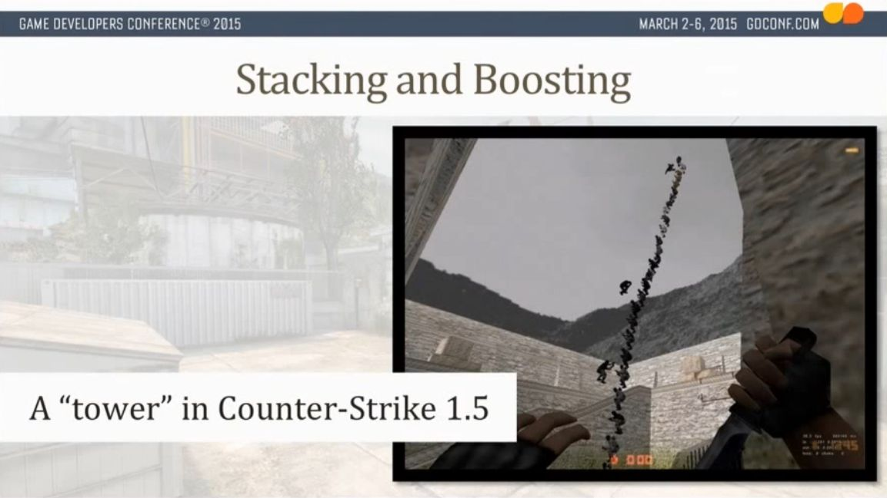
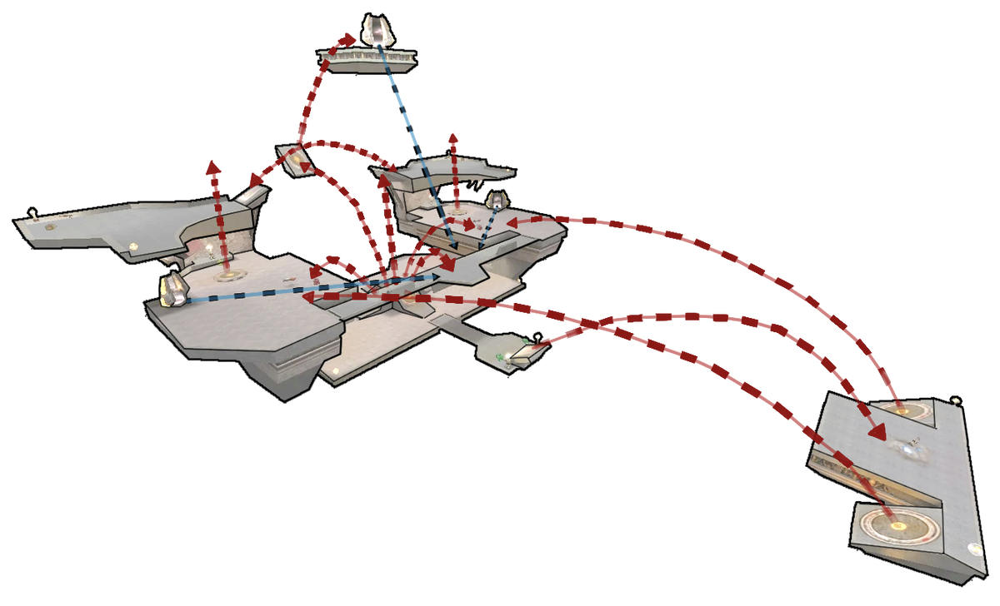

# 垂直移动

**垂直移动**是垂直方向上的玩家流动，向上或者向下移动的感觉。

想象一下逐渐爬上悬崖或者下降深入到黑暗的地牢之中。这些高度变化体现了玩家的游戏进度，帮助指引玩家前往目标。一个任务可能告诉玩家前往北方，但如果不告诉玩家北方在哪，那这就是不可能完成的任务。取而代之，如果任务要求玩家爬到山顶，或者下降到谷底——向上和向下就是更加明确和难以出错的操作。

## 垂直移动机制

当我们讨论垂直移动的时候，我们假设在设计一个有着两种常见物理约束的典型3D动作游戏：

1. 玩家有向下的重力
2. 玩家摄像机很少「滚动」，总是垂直于天空和地平线

如果你改了上述任意一个假设，那「上方」就不再是向上了，这样玩家对于垂直移动的感觉就会很不同。比如，在《超级马力欧银河》中的垂直移动就和《黑暗之魂》中的垂直移动很不同。

### 太多的垂直移动？

许多竞技多人射击游戏和基于竞技场的游戏都需要谨慎地控制垂直移动的使用。

举个例子，在反恐精英 CS 里，竞技选手会把他们的鼠标灵敏度调的很低，因为精确度比反应速度更重要。这导致了不断的高度变化会让他们的瞄准体验很难受，所以大多数 CS 关卡相对平坦。

CS 具有堆叠升高的机制，可以跳到队友肩上，以查看障碍物背后或到达其他方法到不了的地方，这奖励了团队规划和协作。垂直移动可以是情景性的，也可以是战术性的。

<figure><figcaption>
《反恐精英》1.5 中玩家互相堆叠的荒谬例子，来自 GDC 2015：竞技 CS:GO 的社区关卡设计
</figcaption></figure>

## 楼层平面

在规划关卡中的垂直移动时。尝试将其整合为**楼层平面**，并将较小的高度变化合并到单个楼层中。不要试图在你的脑海中同时记住 10 个不同层的平面图，因为玩家大概率也没法处理那么高的复杂度。

大多数地图倾向在任何给定区域上最多有 3 层不同的楼层平面。为什么是 3 层？与三路地图类似，三层由底层、中层和顶层构成。相比之下，第四层并不会增加新的动态变化，因为它只会增加另一个中间层和路径。


*一些资历较老的关卡设计师称之为「Z 平面」，因为在 3DS Max、《毁灭战士》、《雷神之锤》和虚幻引擎里，Z 轴是向上的。但现在，许多游戏引擎和工具使用 Y 轴向上，更不用提图形程序员使用 Z 表示相机深度，所以……还是别用这个说法了吧。*


## 向下的玩家流动

在重力作用下，下落比向上爬升更容易。相比向上的玩家流动，玩家更倾向于向下的玩家流动。

在关卡设计中，最常见的向下的玩家流动是单向门。当玩家从高处掉下来时，他们不能后退，除了前进别无选择。

探索解谜游戏用这种方法来限制玩家一次需要考虑多大的空间，就好像说「在这次下落之前的一切都和当前的挑战无关」。射击游戏严重依赖这种方式来迫使玩家进入[遭遇战](../../combat/encounter.md)，否则玩家可以轻松地回退，通过一个瓶颈来将敌人往回拉。

## 向上的玩家流动

为了克服重力，制造更多的向上的玩家流动，你必须努力制造更多向上的机会。楼梯、斜坡和梯子都是促进垂直移动的常见工具，但是你需要预留足够的空间来放下它们。（电梯因为其脚本的复杂性而不太常见，特别是多层电梯。）

《雷神之锤3：竞技场》（1999）中的多人地图 Q3DM17 「最长的院子」以使用了十几个跳跃垫和传送器而著称，创造了强大的向上玩家流动。由于掩体很少并且只有有限的地板面积，玩家必须通过空中飞行来躲避炮火，同时小心不要摔死。设计师 Brandon James 使用右下角的远处平台来[平衡](../../combat/map_balance.md)了垂直移动；在这里，狙击手可以轻松地躲避来袭的火箭，并且狙击所有沿着可预测飞行弧线移动的玩家。

<figure><figcaption>
Q3DM17「最长的院子」中跳跃垫和传送器轨迹的示意图，作者 Brandon James，《雷神之锤3：竞技场》（1999 年）
</figcaption></figure>

## 主机射击游戏的垂直移动

游戏机上的射击游戏面临着与输入方式相关的特有的关卡设计挑战。由于主机游戏玩家使用带有模拟摇杆的游戏手柄，其固定转动速率使得快速转动和追踪目标变得更加困难。相比之下，鼠标提供了更高的速度和精度。但我们在这里并不是为了争论哪种输入方式更好——我们只是想说，如果你预计你的关卡会有使用游戏手柄的玩家群体，那么你必须相应地进行设计。

对于单人游戏关卡，这意味着在玩家身后生成敌人（「背后生成」）会感觉特别不公平，因为玩家将无法快速转向 180 度，而且飞行敌人的 AI 必须保持适当的距离和稳定的高度。

对于像《光环》或《使命召唤》这样的多人主机射击游戏，玩家通常将准心放在大概位于头部/胸部的高度，并将瞄准运动限制在水平轴上。这些游戏的关卡很少包含剧烈的高度变化，因为它迫使玩家看向极高出或极低处，操作麻烦且对玩家不利。

主机射击游戏的手柄输入只有在关卡设计支持它的情况下才会感觉良好：许多开阔的场景和平缓的斜坡，以及保持相对平坦的地板平面。下面左边的例子有高频率的高度变化，会让游戏手柄玩家感到沮丧，而右边的例子使用更平滑的斜坡和更平坦的地板平面。

TODO：示例图
