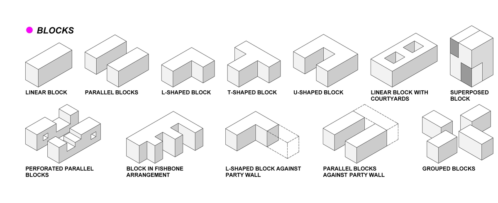
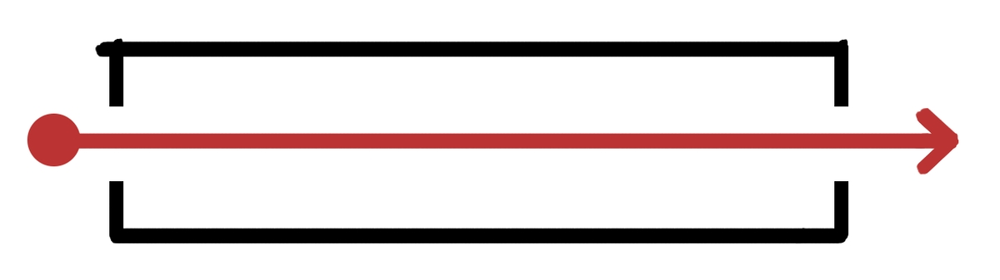
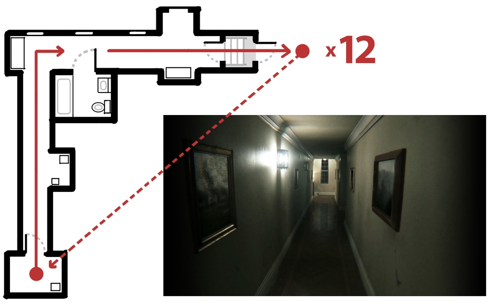
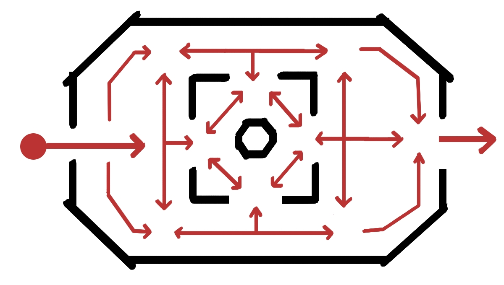

# 类型学

## 什么是类型学？

**类型学**是一种布局设计模式，一种帮我们思考布局的分类系统。它*抽象*了布局——简化并概括了结构。


为什么称为「类型学」而不是「类型」？不只是因为学院派们想要显得与众不同。加上「学」一词提醒我们，它是很大的研究领域，是一个互相联结的思想体系。光说「类型」太笼统了。


<figure><figcaption>
建筑图表「密集住宅建筑的类型学」，<a href="https://densityarchitecture.wordpress.com/2013/01/21/formal-typologies-of-dense-residential-architectures/">由 Maja Baldea（来自博客）</a>
</figcaption></figure>

在上面的现实世界建筑示意图中，Maja Baldea 思考了组织公寓楼的不同方式。她将这些建筑*抽象*（简化、概括）成没有窗户的方块，因为她感兴趣的不是小细节，而是整体形状、[建筑体量](../../blockout/massing/README.md)和[构图](../../blockout/massing/composition.md)，以**分类不同类型**的住宅建筑。

类型学对以下方面很有用： 

- 对不同类型的关卡设计进行分类
- 推理[地图平衡](..\..\combat\map_balance.md)和[遭遇战](..\..\combat\encounter.md)设计
- 开放世界/大逃杀类型的项目，因为不同的类型学会产生不同的游戏内容
- 共享设计术语，有助于团队协作

## 元素

除了墙壁、地板和天花板之外，还有一些常见的*游戏玩法元素*频繁地出现在大多数关卡里：

-  [掩体](..\..\combat\cover.md) 。半掩体 vs. 全掩体，硬掩体 vs. 软掩体。
-  [门](gates.md) 。硬门 vs. 软门，锁和钥匙，正向门和反向门。

## 房间类型学

**房间类型学**是用于关卡单个区域或者「模块」的通用模式。


我们用「房间」作为「空间」的通称。房间可以是花园或洞穴等，这种命名传统可追溯至 90 年代游戏引擎的技术特征，当时即便是户外场景，在引擎中也作为带有天空材质天花板的「房间」来实现。


### 通道

<figure></figure>

以直线路径穿过空间的结构，例如走廊、河流或峡谷。任何具有单向路径、能引导玩家按预定顺序通过的空间序列的结构都可视为通道。

- 强可控性和高确定性：你知道玩家必须要去的地方以及玩家通过需要的大概时间。
- 让玩家加速通过，可以加入下坡地形、单向下落点和明亮的照明
- 让玩家减速通过，可以加入分支区域、凹室和斑驳的照明

#### 通道例子：《P.T.》中的房子

在第一人称恐怖游戏《P.T.》（2014）中，玩家需要一遍又一遍地走过同一个走廊，有一个循环机制，当玩家打开最后的门后就会被传送到起点。游戏充分利用了通道结构的特点，如果采用更开放的空间布局，就不会有那么好的效果了。

<figure><figcaption>
《P.T.》（2014）的平面图和关键路径，来自小岛工作室；为了通关游戏，玩家必须解决隐藏的难题，并在同一条走廊循环至少 12 次
</figcaption></figure>

注意该场景对玩家视线的强力控制，迫使玩家盯着拐角处的窗户，或者绕道进入浴室看到镜子和水槽。恐怖元素和令人不安的凹室让玩家放缓脚步，而线性路径与熟悉感的结合，最终营造出一种不安、恐惧与厄运将至的压抑感。我们所能做的只有继续深入，没有退路。

### 回头路/发夹弯

一个死胡同，但是当你回头后可以看到出口。

- 和通道类似，有高可控性
- 对出口的隐藏会鼓励玩家先探索死胡同
- 短暂的困惑，适中的探索感和方向感

回头路的例子：*Dear Esther* 中的洞穴

### 战斗碗

中间有[掩体]( ..\..\combat\cover.md)的小型开放区域，且通常是像柱子那样的全掩体，让玩家不断地绕中心转圈。特别是在快节奏的战斗游戏里，玩家可以绕中央掩体进行移动射击，同时抵挡敌人的攻击。

- 添加一个单向下落点，迫使特定的玩家流动，也可以引入一些垂直移动

### 竞技场

<figure></figure>

竞技场是有数条[空间流线](..\flow\circulation.md)的开放区域，并且中央有一些[掩体](..\..\combat\cover.md)。

- 开放世界和大逃杀游戏的设计师使用**兴趣点**，即由大型地标标识的具有多出入口的大竞技场
- 在单人游戏中，竞技场通常需要设置[门控](gates.md)；阻止玩家提前离开竞技场，也要挡住入口，防止玩家将所有敌人拉到瓶颈处

#### 例子：《毁灭战士2》中的 Dead Simple 关卡

（TODO：绘制 Dead Simple 的关卡平面图和关键路径）

## 关卡类型学

**关卡类型学**是多个房间/整个关卡的整体布局模式。

### 辐射型

一个较大的多区域模式，有一个中心区域和几个从中心延伸出来的较小区域/通道。要探索不同的分支，玩家必须返回到中心区域。

- 给予不同的分支统一的身份，传达结构逻辑
- 每次探索后需要花功夫更新中心区域，否则会让人感觉在走回头路
- 可以用来调节游戏节奏，因为回到中心让人感觉是一种放松的奖励
- 开始时封锁大部分分支，玩家逐渐解锁捷径

#### 例子：《生化奇兵1》中的医疗站

《生化奇兵1》以具有多个辐射型关卡为特色。在第一章的医疗站中……（这里应该是没写完）

### 环型

（TODO：图表）

一种首位相接的线性空间结构，常见于开放世界的地下城设计中。

- 类似于走廊：强可控性和确定性，减少了玩家的犹豫
- 即使流程本身是线性的，（环型结构）也能让一个区域有非线性感和合理性
- 微妙的回环就像电路循环一样自然合理
- 过于方便的回环会有人造捷径的味道，只是为了玩家体验服务，不自然和人工感较强

### 分支和瓶颈

### 直通型

#### 例子：《上古卷轴V：天际》中的一些地牢

（例子：天际中的关卡草图和截图）

开放世界奇幻 RPG 《上古卷轴V：天际》中有很多地牢，玩家在完成地牢后必须返回主世界。然而，在区域被清空后再进行回溯会让玩家感到单调和机械。（TODO：完成这部分）

## 多人游戏关卡类型学

多人游戏关卡的布局通常更加非线性，有更多回环和双向通道，强调高可重玩性和可以重复使用的区域。许多团队多人游戏设有基地/重生点，玩家可以在此安全地加入游戏，还有供队伍进攻和防守的占领点。

## 反对类型学？

一旦你开始给某事物归类，你就有可能陷入分类本身带来的限制中。有些时候无视类型学和拒绝分类可能更有用。

## 总结

**类型学**是一种归类不同关卡布局的方式。这些词语和标签帮助我们讨论和思考关卡布局。

**房间类型学**是设计单个区域的模式，如通道、回头路，战斗碗和竞技场。

**关卡类型学**是将多个房间按顺序排列的模式，如环型、直通型、分支和瓶颈、辐射型。

## 拓展阅读

- 建筑师 Christopher Alexander 等人的 [《模式语言》](https://en.wikipedia.org/wiki/A_Pattern_Language)（1977）是现代建筑和城市规划的经典类型学手册，开创了新城市主义运动。
- 建筑师 Luke Jones 的[《论「三种类型学」》](https://medium.com/@tlukejones/on-the-three-typologies-ed0b5747fd9c)（2017）是一篇关于建筑师仍然不确定如何对建筑进行分类的精彩文章。
