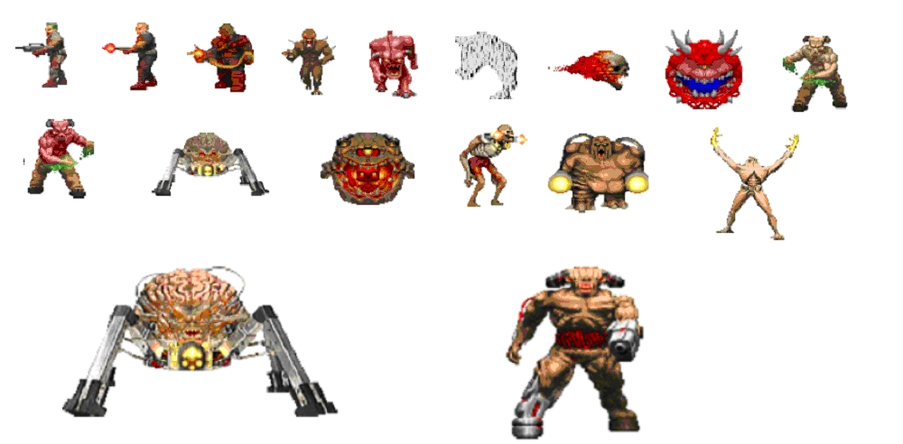

# 节奏设计

## 什么是节奏？

**节奏**是关卡中是关卡中活动和事件的一般顺序和韵律。

单人关卡往往得节奏强烈。存在节奏问题的话，玩家可能对关卡中正发生之事和眼下可以做什么存有疑惑。

有效的节奏计划应处理：

* **范围**：玩家在每个关卡中可做的事；
* **层次**：确定关卡最重要的部分；
* **因果关系**：计划玩家完成不同活动的顺序，并思考作此安排的原因。
* **信息**：在恰当时机，告诉玩家某些信息；
* **情感强度**：玩家在某些时候集中注意力，另一些时候休息并静下心来。

<figure><figcaption>
用于 《风之旅人》 (2012) 的精美节奏/绘图图表，摘自 GDC 2013 上的“Designing Journey”演讲
</figcaption></figure>

## 节拍和变化

关卡中有哪些事件？定义体验的时刻和地点又是什么？

节拍是关卡中独立的一小块；可以是单个区域、事件、活动或元素。

可以类比为音乐节拍。节拍一起演奏时形成旋律和节奏；我们可以单独理解一个节拍，或是将歌曲视作整体去体会。作曲家为了使节拍更富趣味，以不同的方式**安排**节拍，创造**变化**：

* 脉搏：据规律建立重复的节拍模式，有如脉动；构成[节拍](https://zh.wikipedia.org/wiki/%E8%8A%82%E6%8B%8D)；
  * 例如，每个关卡最后都有一个独特出口
* 重音/压力：强调或凸显某些节拍；
  * 有时隐藏或遮蔽出口
* 休息：调和较弱的节拍和沉默，让玩家再次对重音敏感；
  * 又一些时候，凸显出口或使之易于达到
* 主题：较短的重复节拍序列；
  * 在到达出口之前的 Boss 战
* 变化：重复一系列节拍，但具有不同的旋律、节奏等；
  * 某个楼层有不止一个出口
* 切分音：偏离节拍；它是现代流行音乐的基础。
  * 在 Boss 战进行到一半时投放另一个 Boss
  * 虚假的出口后隐藏着怪物
  * 最终 Boss 摧毁出口，玩家无路可退
  * 玩家能够自行创造出口

<figure><figcaption>
强调音乐理论中的不同节拍（韵律、节奏、切分音、预期），摘自 Jack Perricone 的 <em>Melody in Songwriting</em>
</figcaption></figure>

## 大场面

大场面是特别精致的节拍；它具有独特概念或者难忘活动。

这是电影业界之做法。大预算电影项目中充斥着仰仗独特布景和复杂规划的宏伟场面——观众会记住它们。

比如说好莱坞动作大片里，本质上就是一连串大场面：别的部分只是为了半连贯地串起这些精心设计的大型打斗、追逐戏码或者是玩命般的特技（并在紧张的情节之间让观众休息两下）而存在；3A动作游戏运作起来大抵也如此。

不过大场面未必是震天撼地的爆炸动作片段。喜剧里可以是捧腹场景，浪漫剧本里可以强调首约或婚礼，戏剧性故事可能把忏悔或者背叛情节当作特色，谋杀悬疑故事以侦探讲述真相收尾，等等。

电影或游戏里任何重要、令人难忘或者昂贵的场景都可能是大场面。

<figure><figcaption>
动作片 《黑客帝国》 (1999) 中难忘的大堂枪战场面剧照
</figcaption></figure>

<figure><figcaption>
电影《低俗小说》（1994）中令人难忘的舞蹈场面剧照
</figcaption></figure>

回到游戏中，大场面通常：

* **成本高**，打造这样的场面需要制作独特美术/动画资产，并不断迭代。很难缩小工作范围或改变已完成资产用途，因此制作这样的情节/其中的资产本身就有风险；
* **不可跳过**，因为它和项目核心构想及主要体验目标密切关联。如果玩家能跳过这些还批评游戏，花费这么大（时间和金钱）成本来做这些东西就没什么意义了；
* **流程固定，**&#x6216;者说有些线性，确保体验可靠。
  * 交付允许玩家以多种方式体验的大场面意味着开发者要制作多个不同的大场面，花上好几倍成本。

大场面的关卡设计通常包括：

* Boss 战、大型谜题或预编排内容——它包含大量[编写好的关卡脚本](../scripting/)
* 竞技场类型的结构，用一个大房间在玩家完成遭遇战/过场动画前困住 Ta 们；

TODO：在完成翻译后，将地标二字链接到[场景美术](../environment_art/)中的对应部分

* 地标、独特的场景美术资产。使用这些创造出尤为独特的视觉感受。

任何项目中都应该尝试设计和规划至少一个大场面。大场面锚定了项目剩下部分；理想情况下，大场面应当是开发者非常兴奋和期待玩家游玩的部分。如果制作大场面的工作很折磨，甚至做的时候开发者不希望任何玩家真的游玩这些部分，也许应当取消开发。

学习一套新的工具集时，避免构造过于宏伟的大场面。刚刚开始制作游戏的阶段中，很难衡量大场面的工作量；这需要更多经验。请记住：最好的大场面是你正好有机会和能力去完成并交付的大场面。

## 工作流：「堆积节拍」

对于基于战斗的项目和解谜游戏来说，使用单独设计许多节拍并稍后组合的工作方法非常有益。这一工作流如下所示：

1. 构思、布局并勾勒出一场孤立的战斗/一个谜题；
2. 对白盒进行测试和迭代，证明它是有希望的主意或应当舍弃的；
3. 重复步骤1-2，制作出数十个战斗/谜题原型；
4. 根据共同（或对比）元素安排最佳节拍。

第一人称解谜游戏 _Portal_（2007）的原型仅为一系列独立谜题，在策划选择 （2007）的原型仅为一系列独立谜题，在策划选择了最喜欢的那些并编排后才成为一连串关卡。每个房间的介绍牌子上都显示了一系列谜题元素图标，它们正是 「堆积节拍」 工作流的产物。

<figure><figcaption>
<em>Portal</em> 1 关卡中的屏幕截图，展板上的图标显示了谜题中的不同元素
</figcaption></figure>

## 3节拍模式：教学、测试、扭曲

教学、测试、扭曲是关卡设计中常见的3节拍模式。具言之：

* **教学**：教授玩家有关游戏行为的知识；
  * _如在_[ _Portal 1 10号房_ ](https://theportalwiki.com/wiki/Portal_Test_Chamber_10)_中，玩家学习简单的_[ _「投掷」_](https://theportalwiki.com/wiki/Flinging)
* **测试**：给予玩家提示，测试玩家是否可以重复和 _辨识_ 该行为；
  * _在 10 号房中不久后，玩家更深地投掷_
* **扭曲**：改变活动框架。测试玩家是否能够在更少的提示下 _回忆_ 之前的行为；
  * _在 Portal 1 12号房中，玩家在更高的高度投掷_
  * _在 Portal 1 15号房中，玩家在半空中 「双掷」_
  * _然后，18号房中以 「无限投掷」 结束_
  * _关注这些 「扭曲」 节拍的间隔手法；它们并非紧随测试之后_


&#x50;_&#x6F;rtal_ 1 的 Test Chamber 10 中的“teach”和“test”节拍，演示来自 let's play 的视频


## 关键路径

节奏设计过程假定策划可以影响、预测和限制玩家在游戏中的能力/将要做的事情。玩家完成游戏的过程中必须经历的核心过程即为**关键路径**，这一过程包含各类要素。

关键路径形式多样：

* 遭遇战中的关键路径可能是击败敌人的理想策略；
* 解谜中的关键路径是解法；
* 完成跑酷/平台游戏中关卡的路线即为其关键路径。

_详细信息见_[_关键路径_](../layout/critical_path.md)

## 绘制并记录节拍

有几种绘制和记录节拍的方法：

* **节拍表**；节拍的简化文本列表
* **流程图**；节拍相互连接方式的图
* **强度图**；根据关卡体验参数绘制的分段条形图

### 节拍表

节拍表在影视剧本用以概述主要场景和情节。可以在关卡设计中进行类似工作：编写主要事件、场景和关卡的列表。节拍表可以用纸笔书写，也可以借助在线文档/电子表格或是通过在白板上组织卡片实现。接着，将大场面、场景、关卡、Boss 战等想法写成段落/行/卡片/便利贴，重新排列这些节拍形成连贯大纲。

* 团队协作中，当面交谈或打电话即时沟通；
* 一些免费在线白板工具：[Trello](https://trello.com/) 、 [Notion](https://www.notion.so/) 、 [Miro](https://miro.com/) 、 [Codecks](https://www.codecks.io/)；
* 理想情况下使用实体白板。

<figure><figcaption>
<a href="https://youtu.be/6iTBqcBv5QA?t=3160">Rob Meyer 的“Reckoning With Fate: Combat Design at the Scale of Ragnarok”中的“Early Planning and the Shared Healthbar”</a>幻灯片（来自 YouTube）
</figcaption></figure>

节拍表为了适应不同的设计内容和用途，有多种形式。对于动作角色扮演游戏 《战神：诸神黄昏》（2022），主战斗策划 Rob Meyer 编写了如上图所示的 「Boss 流程」 文档，在里面概述 Boss 战场景关键元素和设计原理，帮助他的重度系统战斗概念原型获得批准。

在 《最后生还者》（2013）中，顽皮狗的策划重新安排了整个游戏中的关卡、叙事时刻和主题。下面的 「节拍板」 辅助他们规划了最终游戏的节奏。（它和图片上显示的早期计划有很大区别）

<figure><figcaption></figcaption></figure>
