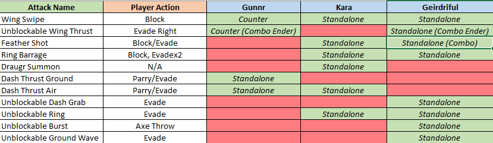

# 节奏设计

## 什么是节奏？

**节奏**是关卡中是关卡中活动和事件的一般顺序和韵律。

单人关卡往往得节奏强烈。存在节奏问题的话，玩家可能对关卡中正发生之事和眼下可以做什么存有疑惑。

有效的节奏计划应处理：

* **范围**：玩家在每个关卡中可做的事；
* **层次**：确定关卡最重要的部分；
* **因果关系**：计划玩家完成不同活动的顺序，并思考作此安排的原因。
* **信息**：在恰当时机，告诉玩家某些信息；
* **情感强度**：玩家在某些时候集中注意力，另一些时候休息并静下心来。

<figure><figcaption>
用于 《风之旅人》 (2012) 的精美节奏/绘图图表，摘自 GDC 2013 上的“Designing Journey”演讲
</figcaption></figure>

## 节拍和变化

关卡中有哪些事件？定义体验的时刻和地点又是什么？

节拍是关卡中独立的一小块；可以是单个区域、事件、活动或元素。

可以类比为音乐节拍。节拍一起演奏时形成旋律和节奏；我们可以单独理解一个节拍，或是将歌曲视作整体去体会。作曲家为了使节拍更富趣味，以不同的方式**安排**节拍，创造**变化**：

* 脉搏：据规律建立重复的节拍模式，有如脉动；构成[节拍](https://zh.wikipedia.org/wiki/%E8%8A%82%E6%8B%8D)；
  * 例如，每个关卡最后都有一个独特出口
* 重音/压力：强调或凸显某些节拍；
  * 有时隐藏或遮蔽出口
* 休息：调和较弱的节拍和沉默，让玩家再次对重音敏感；
  * 又一些时候，凸显出口或使之易于达到
* 主题：较短的重复节拍序列；
  * 在到达出口之前的 Boss 战
* 变化：重复一系列节拍，但具有不同的旋律、节奏等；
  * 某个楼层有不止一个出口
* 切分音：偏离节拍；它是现代流行音乐的基础。
  * 在 Boss 战进行到一半时投放另一个 Boss
  * 虚假的出口后隐藏着怪物
  * 最终 Boss 摧毁出口，玩家无路可退
  * 玩家能够自行创造出口

<figure><figcaption>
强调音乐理论中的不同节拍（韵律、节奏、切分音、预期），摘自 Jack Perricone 的 <em>Melody in Songwriting</em>
</figcaption></figure>

## 套路（不合适吧？先睡了）

套路是特别精致的节拍；它具有独特的概念或者难忘的活动。
